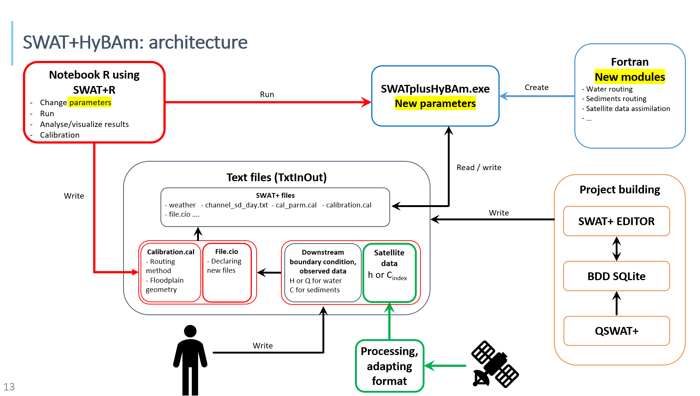
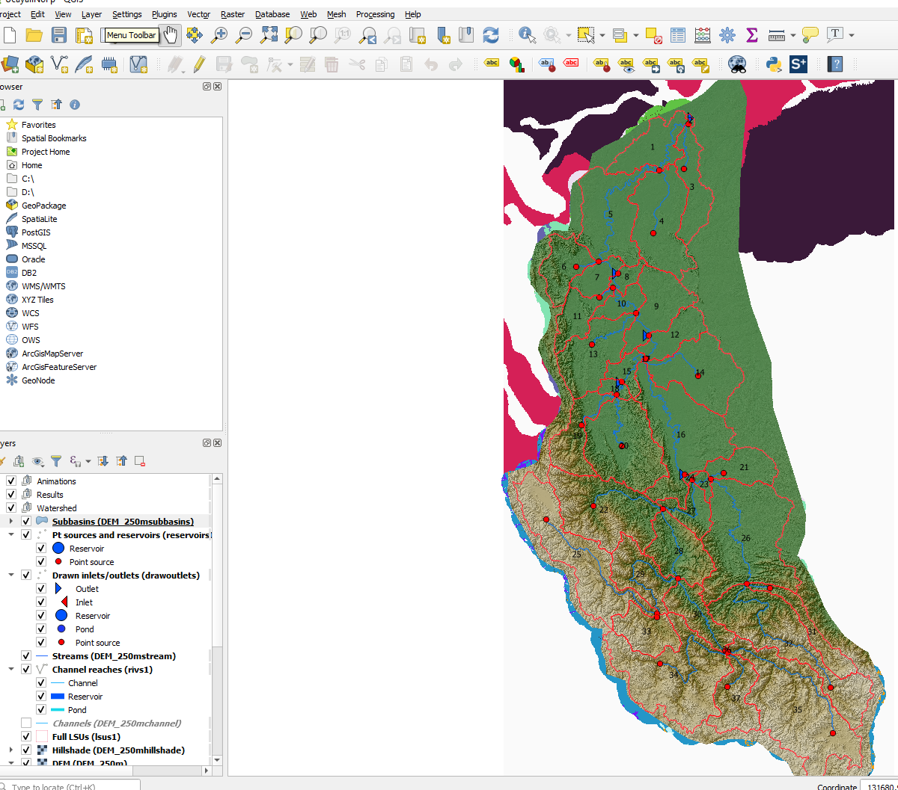
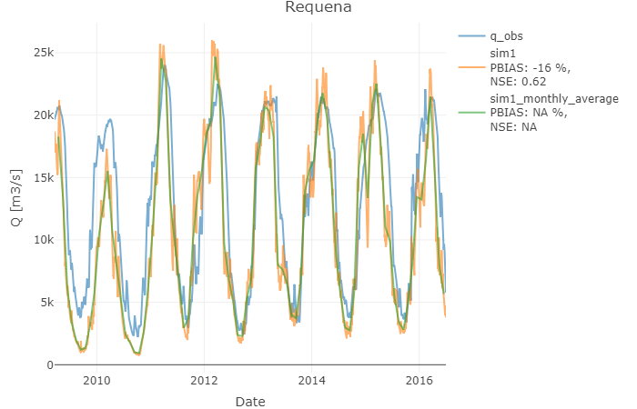
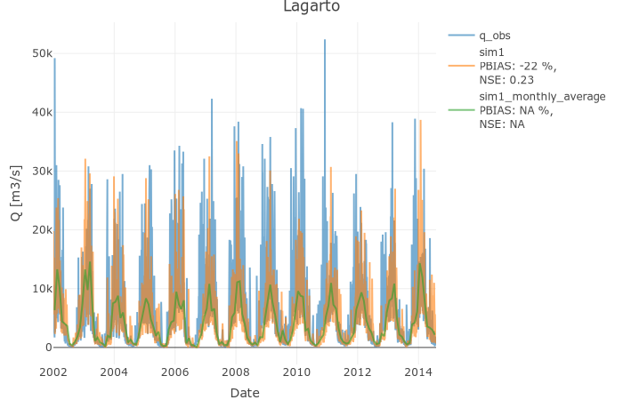

# SWATplusHybam 
`SWATplusHybam` is a modified version of the [SWAT+](https://swat.tamu.edu/software/plus/) model, aiming to enhance water and sediment routing for large basins (such as the Amazon basin). This version is handled from a simple R program based on the [SWATplusR](https://github.com/chrisschuerz/SWATplusR) package.

SWATplusHybam is under development and hasn't been tested on many devices and projects yet, keep in mind that it will be updated at some point and unknown errors might occur. Feed back and suggestions are highly appreciated, please don't hesitate to [Contact](#Contact) us.

## Table of content
* [Introduction](#Introduction)
* [Installation](#Installation)
* [Getting started](#Getting-started)
* [Calibration](#Calibration)
* [Contact](#Contact)

## Introduction
The `SWATplusHybam` package is divided into two parts : The modified Fortran program of the SWAT+ model (SWATplusHybam.exe) and the R notebook (SWAT_analysis) which is a tool to link SWAT+ projets with your modeling workflows in R.



The `SWATplusHybam` provides the same functionalities as the SWAT+ model but adds new methods regarding water and sediment routing, as well as flexibility on the input parameters.
- A modified version of the SWAT Muskingum routing method was implemented. In this version, the parameter K is a function of the water level. In particular, this method allows to increase the lag time of the flood wave propagation (and the water volume stored in the conceptual reservoir) when the floodplain is active.
- Two hydraulic routing (1d) were also implemented:
  - The kinematic wave approximation of the shallow water equations
  - The diffusive wave approximation

For both hydraulic methods, a floodplain reservoir can be parametrized in order to propagate the flood wave with attenuation. The user has the choice between two floodplain geometries: First, a reservoir with a rectangular cross-section, and secondly a reservoir with a triangular cross-section.

These new algorithms regarding water and sediment routing were firstly developed into SWAT 2012 by William Santini (william.santini@ird.fr) and are detailed in his PhD (Santini et al. 2019). Code maintenance and translation (from SWAT2012 to SWAT+) were done by Florent Papini (florent.papini@ird.fr).

 The `SWATplusHybam` package also provides a R notebook, SWAT_analysis.rmd, which purpose is to simplify the use of `SWATplusHybam` model by providing functions and tools to initialize and run your project. There are also some functions allowing an easy analysis of results. This notebook is mainly based on the SWATplusR package developed by Christoph Schuerz (christoph.schuerz@boku.ac.at).

## Installation

### Install the main package
Download the right SWATplusHybam repository depending on your OS system (SWATplusHybam_64 for windows 64...). Extract the SWATplus.exe executable and the .dll files in your project working directory (your_project/scenarios/Default/TxtInOut/).

`SWATplusHybam` is meant to be piloted from a R program, so it is highly recommended to download the SWAT_analysis repository containing a R notebook showing the basics to run the model and a R file containing some helpful functions.

### Install SWATplusR
Last thing you need to do is to go on your R IDE and install [SWATplusR](https://github.com/chrisschuerz/SWATplusR)
```r
# If you do not have the package devtools installed
install.packages("devtools")

devtools::install_github("chrisschuerz/SWATplusR")
```
If you encounter any issue during this step, please refer to the [SWATplusR](https://github.com/chrisschuerz/SWATplusR) page.

## Getting started

### Run the demo
- Download the whole Git Hub repository
- Download the latest R version and an IDE supporting the R notebook such as Rstudio.

Once you got it all set up you need to download the main libraries that will be used for a simple run. You can open the R notebook SWATplus_analysis.rmd in the SWAT_analysis folder and write in the console the following commands.
```r
install.packages("devtools")
devtools::install_github("chrisschuerz/SWATplusR")

install.packages("readr")
install.packages("plotly")
install.packages("hydroGOF")
```

Now you can load the useful libraries and functions for this example.
```r
library(SWATplusR)
library(readr)
library(hydroGOF)
library(plotly)

source("tools_and_functions.R")
```

This demo project is based on the Ucayali basin.


Set up the path to your project. Set up the new parameters from SWATplusHybam and hbc.txt (height boundary condition) will be used for the diffusive wave algorithm.
```r
# Put the path to your TxtInOut file here
project_path <- "path_to_project/demo"

setup_input_files(project_path, "hbc.txt;hyd;1")
setup_par_bounds(project_path)
setup_new_ch_parm(project_path)
```

Run the model. You need to give the project path and the start and end date and number of warm up years. There are a lot of output types but we will be focusing on discharge at Requena one this example. Be careful, the channel (unit) number is not always the same as the basin number.
```r
q_sim_day <- run_swatplus(project_path = project_path,
                          output = define_output(file = "channel_sd",
                                                  variable = "flo_out",
                                                  unit = 1),
                          start_date = "2010-1-1",
                          end_date = "2016-1-1",
                          years_skip = 2)
```

You can see the output is a tibble, it's a "lazy" dataframe and it's quite usefull to store any kind of stuff. What's interesting is the simulation section.
```r
q_sim_day
```

Load observed data, we will use water discharge at Requena for this example.
```r
q_obs = read_csv(file = paste(project_path, "/Qobs_req.csv", sep = ""))
q_obs$Date <- as.Date(q_obs$Date, format = "%Y-%m-%d")
```

Plot your results. The function "plot_results" is just a simple function to plot data but if you want to customize it, feel free to modify it in the tools_and_functions.r file.
```r
start_date = '2012-09-01'
end_date = '2015-7-30'
title = 'Requena'

sim_m_average = flow_monthly_average(q_sim_day$simulation)

# Always start with observed or your reference data!
simulations = list(q_obs, q_sim_day$simulation, sim_m_average)
simulation_names = list("q_obs", "base SWAT+", "average")

# Function to plot easily multiple figures of a same format
plot_results(simulations, simulation_names, start_date, end_date, title)
```


Base SWAT+ doesn't give the precise result we are looking for. The new water routing methods can be selected as an argument for the run_swatplus function. Don't forget to modify the variable name or you will erased the previous simulation. The Muskingum method is the parameter no_rte = 3.0.
```r
par_single <- c("no_rte.bsn|change = absval" = 3.0)

q_sim_day_2 <- run_swatplus(project_path = project_path,
                          output = define_output(file = "channel_sd",
                                                  variable = "flo_out",
                                                  unit = 1),
                          parameter = par_single,
                          start_date = "2010-1-1",
                          end_date = "2016-1-1",
                          years_skip = 2)
```

You can plot the difference.
```r
start_date = '2012-09-01'
end_date = '2015-7-30'
title = 'Requena'

sim_m_average = flow_monthly_average(q_sim_day$simulation)

# Always start with observed or your reference data!
simulations = list(q_obs, q_sim_day$simulation, sim_m_average, q_sim_day_2$simulation)
simulation_names = list("q_obs", "base SWAT+", "average", "kinematic wave")

# Function to plot easily multiple figures of a same format
plot_results(simulations, simulation_names, start_date, end_date, title)
```

### Going further
Kinematic and Diffusive methods are also available.
```r
par_single <- c("no_rte.bsn|change = absval" = 1.0)
par_single <- c("no_rte.bsn|change = absval" = 2.0)
```
```r
q_sim_day_3 <- run_swatplus(project_path = project_path,
                          output = define_output(file = "channel_sd",
                                                  variable = "flo_out",
                                                  unit = 1),
                          parameter = par_single,
                          start_date = "2010-1-1",
                          end_date = "2016-1-1",
                          years_skip = 2)
```

You can also have multiple reaches as an ouput.
```r
q_sim_day_3 <- run_swatplus(project_path = project_path,
                          output = define_output(file = "channel_sd",
                                                  variable = "flo_out",
                                                  unit = 1:3),
                          parameter = par_single,
                          start_date = "2010-1-1",
                          end_date = "2016-1-1",
                          years_skip = 2)
```

You can modify multiple parameter at once, and by different ways.
```r
par_set <- c("no_rte.bsn|change = absval" = 1.0,
             "cn2.hru|change = abschg" = 80.0,
             "alpha.aqu|change = pctchg" = - 5)
```


Or you can do sets of simulation with random inputs.
```r
#Flow routing module
par_set <- tibble("cn2.hru|change = abschg" = runif(8,-15,10),
                  "alpha.aqu|change = absval" = runif(8, 0, 1))

q_sim_day <- run_swatplus(project_path = project_path,
                          output = define_output(file = "channel_sd",
                                                  variable = "flo_out",
                                                  unit = 1:3),
                          parameter = par_set,
                          start_date = "2010-9-1",
                          end_date = "2015-8-1",
                          years_skip = 2,
                          n_thread = 4)
```
It allows you to perform research on the best input arguments.

### Perform your first model
In order to use the SWATplusHybam model you need to set up your project through QGIS with the QSWAT+ plugin. You can find great video tutorials on the [SWAT+](https://swat.tamu.edu/software/plus/) website. Then initialize weather data and modify parameters if needed, you can go back to this step at any time if you want. The import point is the step "write input files" as once it's done you can close QGIS and SWATplusEditor they will not be needed for running the model and analyze data. You can go through the step "Run SWAT+" on SWATplusEditor but it's not going to run the new model `SWATplusHybam`.

If you went successfully through the set up you can now go on the R notebook `SWAT_analysis` and try to perform a first run. There are no currently demo data, you will have to use one of your QSWAT+ project.

```r
# Load your libraries
library(SWATplusR)
source("tools_and_functions.R")

# Put the path to your TxtInOut file here
project_path <- "your_path/your_project/Scenarios/Default/TxtInOut"
setup_new_ch_parm(project_path)
```

```r
q_sim_day <- run_swatplus(project_path = project_path,
                         output = define_output(file = "channel_sd",
                                                 variable = "flo_out",
                                                 unit = 1))
```

[SWATplusR](https://github.com/chrisschuerz/SWATplusR)

### Analyze the model output
The following code is a simple plot example you can do with the functions included in the SWAT_analysis package.
```r
start_date = '2002-01-01'
end_date = '2014-07-31'
title = 'Lagarto'

# Always start with observed or your reference data!
simulations = list(q_obs, sim_csv, sim_month)
simulation_names = list("q_obs", "sim1", "sim1_monthly_average")

# Function to plot easily multiple figures of a same format
plot_results(simulations, simulation_names, start_date, end_date, title)
```


Other simple ways to plot your data are shown on the [SWATplusR](https://chrisschuerz.github.io/SWATplusR/articles/04_vis_example.html) Git page.


## Calibration

### Input parameters
`SWATplusHybam` offers the possibility to chose among multiple water routing methods. Each of these Fortran routines are described in Santini & al.
| Number | Water routing method (no_rte) | Boundary condition requirement | Parameters |
| --- | --- | --- | --- |
| 0 | SWAT+ routing | No | None |
| 1 | Kinematic | No | None |
| 2 | Diffusive | Yes | None |
| 3 | Muskingum with variable K parameter | No | MKKCO1, MKKCO1, MKKCO3, MKKX |

Parameter changes in a R notebook is already available thanks to parameter sets as described in [SWATplusR](https://github.com/chrisschuerz/SWATplusR). So here we are using the same trick to chose the water routing algorithm.
```r
par_single = c("no_rte.bsn|change = abschg" = 1)
```
| Parameter | Range | Description |
| --- | --- | --- |
| no_rte.bsn | 0.0:3.0 | Water routing method |
| fpgeom.bsn | 0.0:1.0 | Type of floodplain 0 is squared, 1 triangular |
| theta_fp.bsn | 0.0:10.0 | Floodplain angle (Case of a tri. section) [rad] |
| alpha_f.bsn | 0.0:10.0 | 0.2 < alpha < 0.7 (Bates et al., 2010) |
| cnfp.bsn | 0.0:10.0 |  |
| mkkco1.bsn | 0.0:10.0 |  |
| mkkco2.bsn | 0.0:10.0 |  |
| mkkco3.bsn | 0.0:10.0 |  |
| mkkx.bsn | 0.0:10.0 |  |

A lot of parameters can already be changed for calibration on the [SWAT+](https://swatplus.gitbook.io/docs/user/editor/inputs/change-calibration) model but the website is not yet updated. You can go and check the cal_parm.cal file in the TxtInOut folder to see the list of available parameters.

### Input files
A new feature from `SWATplusHybam` is the ability to handle observed data, in order to use them as limit conditions or to do data assimilation for example. This observed data has to come as a .txt file and has it's type has to be specified in the functions Below.
```r
setup_input_files(project_path, list("hbc.txt;hyd;1", "Qsf_lag.txt;sands;1"))
```
"hbc.txt" is the file with the observations, "hyd" is the type of file (see below) and "1" is the reach where your observed data has been measured.


Only three types are available for now but some might be added later. You can currently provide a water, sand or wash load limit condition file or files for data assimilation (in progress).
```r
q_sim_day <- run_swatplus(project_path = project_path,
                         output = define_output(file = "channel_sd",
                                                 variable = "flo_out",
                                                 unit = 1),
                         start_date = "2013-1-1",
                         end_date = "2018-1-1",
                         years_skip = 2)
                         parameter = par_single)
```


## Contact
Created by William Santini (william.santini@ird.fr) and Florent Papini (florent.papini@ird.fr)
